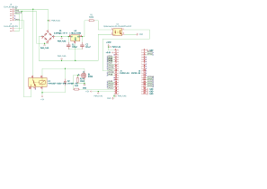

ESP32 Door Buzzer
=================

Overview
--------

Schematic to connect an ESP32-S3 to a door buzzer and door lock.

Purpose
-------

Use an ESP32-S3 to release the door lock and monitor when the door buzzer is
pressed.

Usage
-----

This is a KiCad project.

Schematic
----------

Header J3 is aligned to match the K1 relay on a breadboard.

Header J4 is for future use to allow the ESP32-S3 to connect/disconnect the phone buzzer.

Components
----------

+---------------------+----------+--------------------------------------------------------------+
| Refs                | Quantity | Name                                                         |
+=====================+==========+==============================================================+
| C1                  |     1    | 100µF Capacitor, Through Hole                                |
+---------------------+----------+--------------------------------------------------------------+
| C2                  |     1    | 0.1µF Capacitor, Through Hole                                |
+---------------------+----------+--------------------------------------------------------------+
| D1                  |     1    | Multicomp MP606G Bridge Rectifier, Through Hole              |
+---------------------+----------+--------------------------------------------------------------+
| J1, J2              |     2    | 1x20 Pin Socket, Through Hole (2.54mm)                       |
+---------------------+----------+--------------------------------------------------------------+
| J3                  |     1    | 1x06 Pin Header, Through Hole (2.54mm)                       |
+---------------------+----------+--------------------------------------------------------------+
| J4                  |     2    | 1x02 Pin Header, Through Hole (2.54mm)                       |
+---------------------+----------+--------------------------------------------------------------+
| K1                  |     1    | HUI KE HK4100F 5V Relay, Through Hole                        |
+---------------------+----------+--------------------------------------------------------------+
| Q1                  |     1    | ON Semiconductor BS170 N-Channel MOSFET, TO-92-3             |
+---------------------+----------+--------------------------------------------------------------+
| R1                  |     1    | 390Ω Resistor, Through Hole                                  |
+---------------------+----------+--------------------------------------------------------------+
| R2                  |     1    | 10kΩ Resistor, Through Hole                                  |
+---------------------+----------+--------------------------------------------------------------+
| R3                  |     1    | 1kΩ Resistor, Through Hole                                   |
+---------------------+----------+--------------------------------------------------------------+
| U1                  |     1    | ON Semiconductor FOD817 Optocoupler, DIP-4                   |
+---------------------+----------+--------------------------------------------------------------+
| U2                  |     1    | STMicroelectronics L78L12 Voltage Regulator, TO-92-3         |
+---------------------+----------+--------------------------------------------------------------+
